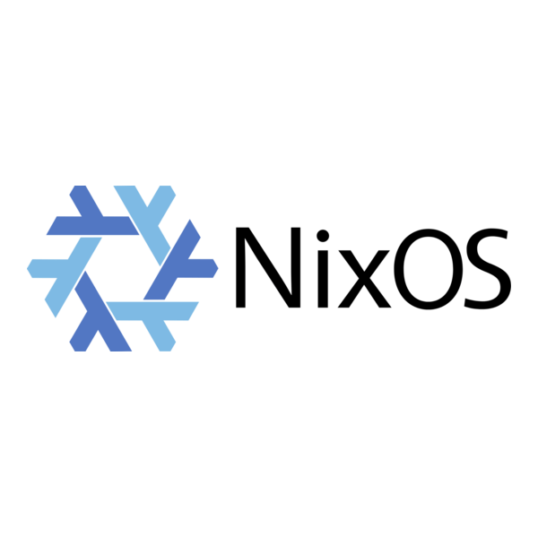

<div align="center">
    
</div>

<br>

# NixOS Configuration

<br>
<div align="center">
    <a href="https://github.com/kryisnn/Nixos-Config/stargazers">
        
    </a>
    <a href="https://github.com/kryisnn/Nixos-Config/">
        
    </a>
    <a href="https://nixos.org">
        
    </a>
    <a href="https://github.com/kryisnn/Nixos-Config/blob/main/LICENSE">
        
    </a>
</div>
<br>

**NixOS Configuration** simplifies and unifies your Linux ecosystem with a modular, minimalist & easily customizable setup built with Flakes and Home Manager. It provides a structured way to manage system-level configurations, hardware-specific setups, and user environments (including Hyprland, Waybar, TUI tools, and server configurations) across multiple hosts.

**Features:**

- 💻 Multiple Hosts: Designed for powerhouse workstations, portable laptops, headless servers, and VMs
- 🎨 Consistent Theming: Stylix-powered system-wide theming
- 🛠️ Modular Design: Clean separation of core settings, host definitions, and feature modules
- 🔒 Secure by Default: Ready for sops-nix secrets, impermanence, and secure SSH setups

## Table of Content

<!-- START doctoc generated TOC please keep comment here to allow auto update -->
<!-- DON'T EDIT THIS SECTION, INSTEAD RE-RUN doctoc TO UPDATE -->

- [Available Hosts](#available-hosts)
- [Architecture](#architecture)
- [Installation](#installation)
  - [Method 1: Fresh NixOS Installation (No Desktop / TTY)](#method-1-fresh-nixos-installation-no-desktop--tty)
  - [Method 2: Installation from a NixOS Graphical Installer (Live USB)](#method-2-installation-from-a-nixos-graphical-installer-live-usb)
- [Updating the System](#updating-the-system)

<!-- END doctoc generated TOC please keep comment here to allow auto update -->

## Available Hosts

This flake defines the following hosts:

- **`powerhouse`**: Primary workstation configuration, featuring a Hyprland desktop environment, NVIDIA GPU support, and heavy development/gaming tools.
- **`portable`**: Laptop configuration, optimized for battery life, portability, and Wayland desktop usage.
- **`server`**: Headless server configuration featuring Samba NAS, Nextcloud, Immich, Glance, and secure SSH setups.
- **`vm`**: Virtual machine configuration for testing and isolated development.

## Architecture

- `core/`: Fundamental configurations and default variables shared across hosts.
- `hosts/`: Host-specific configurations (powerhouse, portable, server, vm).
- `modules/`: Feature-specific modules, split into `home/` (Home Manager) and `system/` (NixOS system layer).
- `themes/`: Stylix profiles for system-wide styling.

## Installation

Before installing, ensure you have enabled Flakes in your NixOS configuration. The system expects this repository to be cloned to `~/Documents/Nixos-Config`.

### Method 1: Fresh NixOS Installation (No Desktop / TTY)

If you have just installed a minimal NixOS system without a desktop environment and rebooted into your new system:

1. **Log in** to your user account (e.g., `kryisnn`).
2. **Clone this repository** into the expected directory:
   ```bash
   mkdir -p ~/Documents
   git clone https://github.com/kryisnn/Nixos-Config.git ~/Documents/Nixos-Config
   cd ~/Documents/Nixos-Config
   ```
3. **Copy your hardware configuration**:
   During your minimal install, NixOS generated a hardware profile. Copy it to the host you intend to use:
   ```bash
   cp /etc/nixos/hardware-configuration.nix hosts/<your-host>/hardware-configuration.nix
   ```
4. **Build and switch** to the new configuration:
   ```bash
   sudo nixos-rebuild switch --flake .#<your-host>
   ```
5. **Reboot** to initialize the full desktop environment or server services.

### Method 2: Installation from a NixOS Graphical Installer (Live USB)

If you are currently booted into the NixOS Live USB and want to install directly from this flake onto a fresh drive:

1. **Partition and format your disks**, then mount your target root partition to `/mnt` (and your boot partition to `/mnt/boot`).
2. **Generate the hardware configuration** for the target system:
   ```bash
   sudo nixos-generate-config --root /mnt
   ```
3. **Clone the repository** (temporarily, to the live environment):
   ```bash
   git clone https://github.com/kryisnn/Nixos-Config.git /tmp/Nixos-Config
   cd /tmp/Nixos-Config
   ```
4. **Copy the generated hardware configuration** into the flake:
   ```bash
   cp /mnt/etc/nixos/hardware-configuration.nix hosts/<your-host>/hardware-configuration.nix
   ```
5. **Install NixOS** using the flake:
   ```bash
   sudo nixos-install --flake .#<your-host>
   ```
6. **Set a password** for the user/root when prompted by the installer.
7. **Reboot** and log into your new system. Make sure to re-clone the repository to `~/Documents/Nixos-Config` in your actual user environment for future updates!

## Updating the System

To pull the latest changes and upgrade packages:
```bash
cd ~/Documents/Nixos-Config
nix flake update
sudo nixos-rebuild switch --flake .#<your-host>
```

---

<div align="center">
  <a href="https://github.com/kryisnn/Nixos-Config">github</a>
</div>
